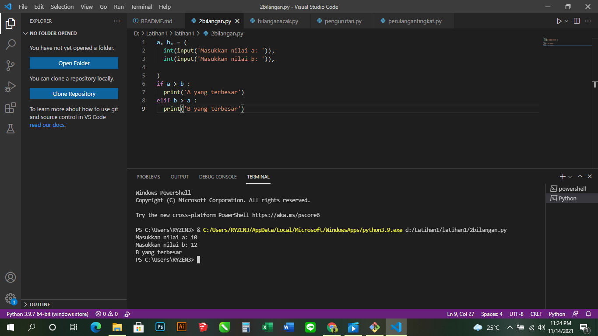

# latihan1ku
## Kondisi dan Perulangan
### Berikut programnya
1.Buat program sederhada dengan input 2 buah bilangan, kemudian
tentukan bilangan terbesar dari kedua bilangan tersebut
menggunakan statement if.

