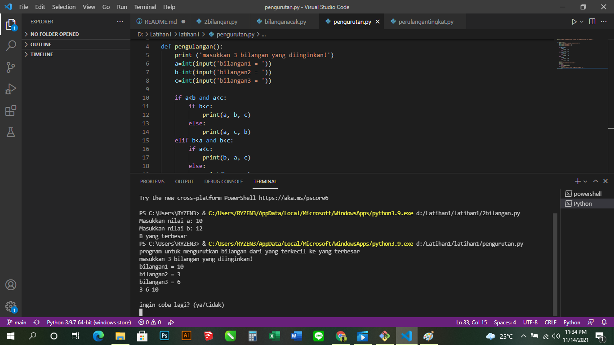
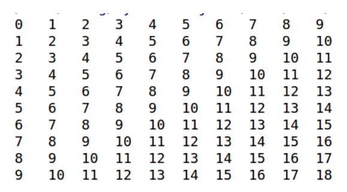
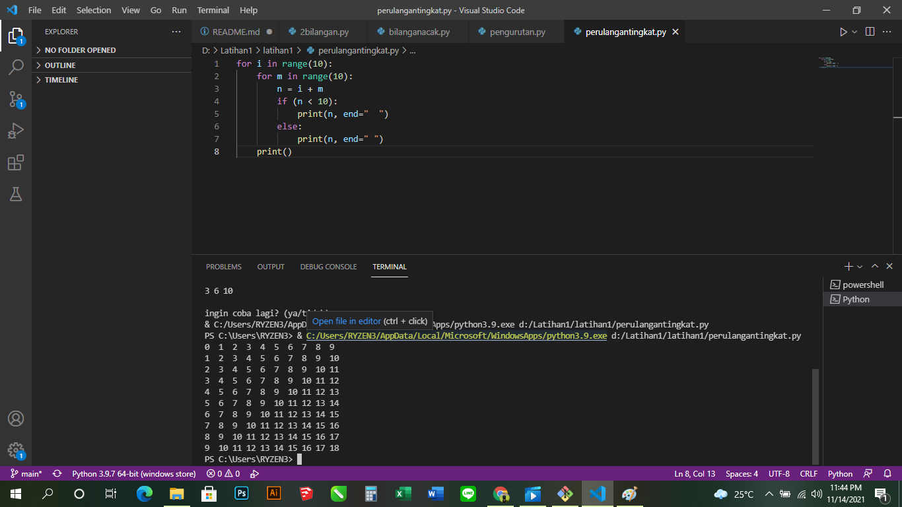

# latihan1ku
## Kondisi dan Perulangan
### Berikut programnya
1. Buat program sederhada dengan input 2 buah bilangan, kemudian
tentukan bilangan terbesar dari kedua bilangan tersebut
menggunakan statement if.

Berikut adalah hasil output nya menggunakan statement if:

    C:\Users\sdnke\PycharmProjects\pythonProject\venv\Scripts\python.exe D:/latihan1kuu/latihan1ku/2bilangan.py
    Masukkan nilai a: 10
    Masukkan nilai b: 12
    B yang terbesar
    Process finished with exit code 0

2. Buat program untuk mengurutkan data berdasarkan input sejumlah
data (minimal 3 variable input atau lebih), kemudian tampilkan
hasilnya secara berurutan mulai dari data terkecil.

Berikut untuk hasil output dari program nya:

    C:\Users\sdnke\PycharmProjects\pythonProject\venv\Scripts\python.exe D:/latihan1kuu/latihan1ku/pengurutan.py
    program untuk mengurutkan bilangan dari yang terkecil ke yang terbesar
    masukkan 3 bilangan yang diinginkan!
    bilangan1 = 10
    bilangan2 = 3
    bilangan3 = 6
    3 6 10

    ingin coba lagi? (ya/tidak)

3. Buat program dengan perulangan bertingkat (nested) for yang 
menghasilkan output sebagai berikut:

Berikut Program nya:

Berikut untuk output dari program tersebut:

    C:\Users\sdnke\PycharmProjects\pythonProject\venv\Scripts\python.exe D:/latihan1kuu/latihan1ku/perulangantingkat.py
    0  1  2  3  4  5  6  7  8  9  
    1  2  3  4  5  6  7  8  9  10 
    2  3  4  5  6  7  8  9  10 11 
    3  4  5  6  7  8  9  10 11 12 
    4  5  6  7  8  9  10 11 12 13 
    5  6  7  8  9  10 11 12 13 14 
    6  7  8  9  10 11 12 13 14 15 
    7  8  9  10 11 12 13 14 15 16 
    8  9  10 11 12 13 14 15 16 17 
    9  10 11 12 13 14 15 16 17 18 
    Process finished with exit code 0

    